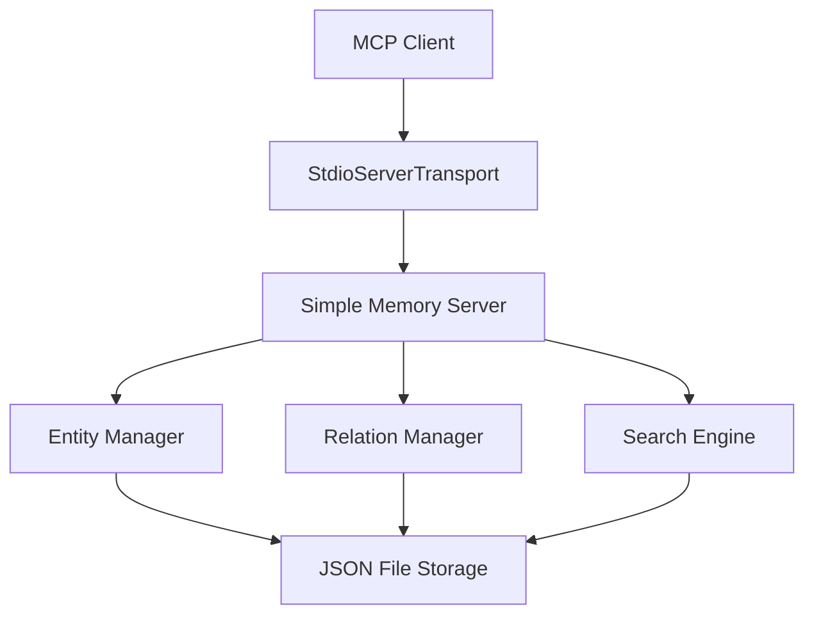

# Simple Memory MCP Server

A lightweight Model Context Protocol (MCP) server that provides persistent knowledge graph storage for AI assistants. Enables AI agents to maintain memory across sessions through entity-relationship storage with JSON file persistence.

## 🚀 Features

- **Persistent Memory**: Knowledge graph storage with automatic persistence to JSON files
- **Entity Management**: Create, read, update, and delete entities with typed observations
- **Relationship Tracking**: Manage relationships between entities with type annotations
- **Search Capabilities**: Full-text search across entity names, types, and observations
- **MCP Compliant**: Full Model Context Protocol v2025-06-18 compatibility
- **Simple Architecture**: Lightweight, single-file implementation with minimal dependencies

## 📋 Table of Contents

- [Installation](#installation)
- [Quick Start](#quick-start)
- [API Reference](#api-reference)
- [Configuration](#configuration)
- [Testing](#testing)
- [Troubleshooting](#troubleshooting)
- [Development](#development)

## 🛠 Installation

### Interactive Installation (Recommended)

```bash
# Bash installer with interactive configuration
curl -fsSL https://raw.githubusercontent.com/your-username/simple-memory-mcp/main/install.sh | bash
```

**What it does:**
- 🔍 Auto-detects your Obsidian vaults
- 📁 Configures custom memory storage location  
- ⚙️ Sets up Claude Desktop/Cursor automatically
- 🗂️ Optional Obsidian auto-export configuration

**Interactive Setup Flow:**
```
📁 Memory Storage Configuration
Where should memory be stored? [~/.cursor/memory.json]: 

🗂️ Obsidian Integration  
Do you use Obsidian? (y/n) [n]: y

📚 Found Obsidian vaults:
  1. My Knowledge Base (/Users/you/Documents/MyVault)
  2. Work Notes (/Users/you/Desktop/WorkVault)
Choose vault (1-2) or enter custom path [1]: 1

Enable auto-export after entity creation? (y/n) [n]: y
Export format (markdown/dataview/canvas/all) [markdown]: all
```

### Manual Installation

#### Prerequisites

- Node.js v18.x or higher
- npm or pnpm package manager

#### Install Dependencies

```bash
npm install
```

### Environment Setup

The server automatically saves memory to:
- `~/.cursor/memory.json` (default)
- Custom path via `MEMORY_PATH` environment variable

```bash
# Optional: Set custom memory file location
export MEMORY_PATH="/path/to/your/memory/directory"
```

## 🚀 Quick Start

### 1. Start the Server

```bash
npm start
# or
node index.js
```

### 2. Test with MCP Inspector

```bash
# Install and run MCP Inspector
npx @modelcontextprotocol/inspector

# Configure server in Inspector:
# Command: node
# Args: /path/to/your/simple-memory-mcp/index.js
```

### 3. Basic Usage Example

```javascript
// Create entities
await client.callTool({
  name: "create_entities",
  arguments: {
    entities: [{
      name: "john-doe",
      entityType: "person",
      observations: ["Software engineer", "Works remotely", "Enjoys hiking"]
    }]
  }
});

// Create relationships
await client.callTool({
  name: "create_relations",
  arguments: {
    relations: [{
      from: "john-doe",
      to: "acme-corp",
      relationType: "works_for"
    }]
  }
});

// Search entities
await client.callTool({
  name: "search_nodes",
  arguments: {
    query: "engineer"
  }
});
```

## 📚 API Reference

### Tools Overview

| Tool | Description | Input | Output |
|------|-------------|-------|--------|
| `create_entities` | Create multiple entities | `{entities: Entity[]}` | Created entities |
| `create_relations` | Create relationships | `{relations: Relation[]}` | Created relations |
| `add_observations` | Add observations to entities | `{observations: Observation[]}` | Updated observations |
| `delete_entities` | Delete entities and relations | `{entityNames: string[]}` | Deleted entities |
| `delete_observations` | Remove specific observations | `{deletions: Deletion[]}` | Deleted observations |
| `delete_relations` | Remove relationships | `{relations: Relation[]}` | Deleted relations |
| `read_graph` | Get complete knowledge graph | `{}` | Full graph data |
| `search_nodes` | Search entities by query | `{query: string}` | Matching entities |
| `open_nodes` | Get specific entities | `{names: string[]}` | Requested entities |
| `export_to_obsidian` | Export graph to Obsidian vault | `{vaultPath: string, format?: string}` | Export result |

### Data Types

#### Entity
```typescript
interface Entity {
  name: string;           // Unique identifier
  entityType: string;     // Type classification
  observations: string[]; // Array of observation texts
}
```

#### Relation
```typescript
interface Relation {
  from: string;          // Source entity name
  to: string;            // Target entity name
  relationType: string;  // Relationship type
}
```

#### Observation
```typescript
interface Observation {
  entityName: string;    // Target entity name
  contents: string[];    // New observations to add
}
```

#### Deletion
```typescript
interface Deletion {
  entityName: string;      // Target entity name
  observations: string[];  // Observations to remove
}
```

### Detailed Tool Documentation

#### `create_entities`

Creates multiple new entities in the knowledge graph.

**Input Schema:**
```json
{
  "entities": [
    {
      "name": "entity-name",
      "entityType": "person|organization|concept|etc",
      "observations": ["observation1", "observation2"]
    }
  ]
}
```

**Example:**
```json
{
  "entities": [
    {
      "name": "alice-johnson",
      "entityType": "person",
      "observations": ["Data scientist", "PhD in Computer Science", "Lives in San Francisco"]
    },
    {
      "name": "tech-startup-xyz",
      "entityType": "organization", 
      "observations": ["AI/ML company", "Founded in 2023", "Series A funding"]
    }
  ]
}
```

**Response:**
```json
[
  {
    "name": "alice-johnson",
    "entityType": "person",
    "observations": ["Data scientist", "PhD in Computer Science", "Lives in San Francisco"]
  }
]
```

#### `create_relations`

Creates relationships between existing entities.

**Input Schema:**
```json
{
  "relations": [
    {
      "from": "source-entity",
      "to": "target-entity", 
      "relationType": "relationship-type"
    }
  ]
}
```

**Example:**
```json
{
  "relations": [
    {
      "from": "alice-johnson",
      "to": "tech-startup-xyz",
      "relationType": "works_for"
    }
  ]
}
```

#### `search_nodes`

Search entities using full-text search across names, types, and observations.

**Input Schema:**
```json
{
  "query": "search-term"
}
```

**Example:**
```json
{
  "query": "data scientist"
}
```

**Response:** Array of matching entities with complete data.

#### `read_graph`

Returns the complete knowledge graph with all entities and relations.

**Input Schema:**
```json
{}
```

**Response:**
```json
{
  "entities": [
    {
      "name": "alice-johnson",
      "entityType": "person",
      "observations": ["Data scientist", "PhD in Computer Science"]
    }
  ],
  "relations": [
    {
      "from": "alice-johnson",
      "to": "tech-startup-xyz", 
      "relationType": "works_for"
    }
  ]
}
```

#### `export_to_obsidian`

Export the knowledge graph to an Obsidian vault in various formats.

**Input Schema:**
```json
{
  "vaultPath": "/path/to/obsidian/vault",
  "format": "markdown",
  "autoIndex": true
}
```

**Parameters:**
- `vaultPath` (required): Path to the Obsidian vault directory
- `format` (optional): Export format - "markdown", "dataview", "canvas", or "all" (default: "markdown")
- `autoIndex` (optional): Whether to create index files (default: true)

**Example:**
```json
{
  "vaultPath": "/Users/username/Documents/MyVault",
  "format": "all",
  "autoIndex": true
}
```

**Response:**
```json
{
  "success": true,
  "vaultPath": "/Users/username/Documents/MyVault",
  "format": "all",
  "entityCount": 42,
  "relationCount": 18,
  "timestamp": "2024-01-15T10:30:00.000Z"
}
```

## ⚙️ Configuration

### Environment Variables

| Variable | Default | Description |
|----------|---------|-------------|
| `MEMORY_PATH` | `~/.cursor/memory.json` | Custom memory file location |
| `NODE_ENV` | `development` | Runtime environment |
| `OBSIDIAN_AUTO_EXPORT` | `false` | Enable automatic Obsidian export after entity creation |
| `OBSIDIAN_VAULT_PATH` | - | Path to Obsidian vault for auto-export |
| `OBSIDIAN_EXPORT_FORMAT` | `markdown` | Export format for auto-export |

### Memory File Structure

The server persists data in JSON format:

```json
{
  "entities": [
    {
      "name": "entity-name",
      "entityType": "type",
      "observations": ["obs1", "obs2"]
    }
  ],
  "relations": [
    {
      "from": "entity1",
      "to": "entity2",
      "relationType": "relationship"
    }
  ]
}
```

### MCP Client Configuration

For Claude Desktop, add to your MCP settings:

```json
{
  "mcpServers": {
    "simple-memory": {
      "command": "node",
      "args": ["/path/to/simple-memory-mcp/index.js"],
      "env": {
        "MEMORY_PATH": "/custom/path/to/memory/directory"
      }
    }
  }
}
```

## 🧪 Testing

### Running Tests

```bash
# Run comprehensive server test
node test-server.js
```

### Expected Test Output

```
🧪 Testing Simple Memory MCP Server...
✅ Connected successfully!
✅ Found 9 tools: create_entities, create_relations, ...
✅ All tests passed! Server is working correctly.
```

### Manual Testing with Inspector

1. Start MCP Inspector: `npx @modelcontextprotocol/inspector`
2. Configure server connection
3. Test each tool with sample data
4. Verify persistence by restarting server

### Integration Testing

Test with actual MCP clients:

```javascript
import { Client } from "@modelcontextprotocol/sdk/client/index.js";
import { StdioClientTransport } from "@modelcontextprotocol/sdk/client/stdio.js";

const transport = new StdioClientTransport({
  command: "node",
  args: ["index.js"]
});

const client = new Client({
  name: "test-client",
  version: "1.0.0"
}, {
  capabilities: {}
});

await client.connect(transport);
```

## 🔧 Troubleshooting

### Common Issues

#### Server Won't Start

**Error:** `Cannot read properties of undefined (reading 'method')`

**Solution:** Ensure you're using the correct MCP SDK version and schema imports:

```javascript
import {
  ListToolsRequestSchema,
  CallToolRequestSchema,
  ListPromptsRequestSchema,
  ListResourcesRequestSchema
} from '@modelcontextprotocol/sdk/types.js';
```

#### Missing Capabilities Error

**Error:** `Server does not support prompts (required for prompts/list)`

**Solution:** Declare all capabilities in server configuration:

```javascript
const server = new Server(
  { name: 'simple-memory-mcp', version: '1.1.0' },
  {
    capabilities: {
      tools: {},
      prompts: {},
      resources: {}
    }
  }
);
```

#### Memory File Permissions

**Error:** `EACCES: permission denied`

**Solution:** Ensure write permissions to memory directory:

```bash
mkdir -p ~/.cursor
chmod 755 ~/.cursor
```

#### Tool Not Found

**Error:** `Unknown tool: create_entities`

**Solution:** Verify tool registration matches the schema names exactly.

### Debug Mode

Enable detailed logging:

```javascript
console.error("Debug info:", JSON.stringify(data, null, 2));
```

### Performance Issues

For large knowledge graphs (>10,000 entities):

1. Consider implementing pagination for `read_graph`
2. Add indexing for search operations
3. Implement lazy loading for entity details

## 🛠 Development

### Project Structure

```
simple-memory-mcp/
├── index.js              # Main server implementation
├── package.json          # Dependencies and scripts
├── test-server.js        # Comprehensive test suite
├── inspector-config.json # MCP Inspector configuration
├── CLAUDE.md             # AI development protocols
└── README.md             # This documentation
```

### Architecture



### Core Classes

#### `SimpleMemoryServer`

Main server class handling:
- Memory persistence (`loadMemory()`, `saveMemory()`)
- Entity operations (CRUD)
- Relationship management
- Search functionality

**Key Methods:**
- `createEntities(entities)` - Batch entity creation
- `createRelations(relations)` - Relationship creation
- `searchNodes(query)` - Full-text search
- `readGraph()` - Complete graph export

### Extending the Server

#### Adding New Tools

1. Define tool schema in `tools/list` handler
2. Implement logic in `tools/call` handler
3. Add method to `SimpleMemoryServer` class
4. Update documentation

#### Custom Storage Backends

Replace JSON file storage:

```javascript
class DatabaseMemoryServer extends SimpleMemoryServer {
  async saveMemory() {
    // Custom database implementation
  }
  
  async loadMemory() {
    // Custom database loading
  }
}
```

### Contributing

1. Fork the repository
2. Create feature branch: `git checkout -b feature-name`
3. Run tests: `node test-server.js`
4. Commit changes: `git commit -m "Description"`
5. Push branch: `git push origin feature-name`
6. Create Pull Request

## 📄 License

MIT License - see LICENSE file for details.

## 📚 Additional Documentation

- **[Complete Documentation Index](./docs/README.md)** - All technical documentation
- **[API Reference](./docs/API.md)** - Detailed API documentation with TypeScript interfaces
- **[Debugging Guide](./docs/DEBUGGING.md)** - Comprehensive troubleshooting guide
- **[Obsidian Integration](./docs/OBSIDIAN_INTEGRATION.md)** - Visualization and mindmap setup
- **[Implementation Guide](./docs/MCP_BUILTIN_IMPLEMENTATION.md)** - Built-in export implementation
- **[Project Roadmap](./ROADMAP.md)** - Strategic planning and future development

## 🤝 Support

- **Issues**: [GitHub Issues](https://github.com/your-repo/simple-memory-mcp/issues)
- **Documentation**: [MCP Protocol Docs](https://modelcontextprotocol.io/)
- **Community**: [MCP Discord](https://discord.gg/mcp)

---

Built with ❤️ using the [Model Context Protocol](https://modelcontextprotocol.io/)